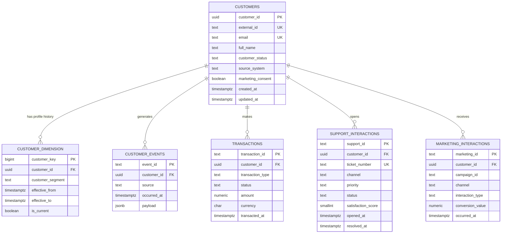

# Customer 360 Data Model

The operational PostgreSQL model stores the current customer profile and source interactions. The Snowflake analytics model uses the same relationships as a star schema: `DIM_CUSTOMER` is a slowly changing Type-2 dimension and each fact table joins through `CUSTOMER_KEY`.

## Grain and key decisions

- `customers`: one current operational row per resolved customer.
- `customer_dimension` / `DIM_CUSTOMER`: one row per customer profile version. Only one version is current.
- `transactions` / `FACT_TRANSACTION`: one row per financial transaction.
- `support_interactions` / `FACT_SUPPORT`: one row per support ticket.
- `marketing_interactions` / `FACT_MARKETING`: one row per customer/campaign interaction.
- PostgreSQL enforces keys and data-quality checks. Snowflake declares informational keys and relies on transformation tests because standard Snowflake tables do not enforce primary and foreign keys.

## Deployment order

PostgreSQL initialization is automatic through the numbered files copied by `docker/postgres.Dockerfile`:

1. `sql/postgres/schema.sql`
2. `sql/postgres/crm_staging.sql`
3. `sql/postgres/indexes.sql`
4. `sql/postgres/seed.sql`

Run Snowflake scripts in this order with a sufficiently privileged role:

1. `sql/snowflake/warehouse.sql`
2. `sql/snowflake/staging.sql`
3. `sql/snowflake/marts.sql`
4. `sql/snowflake/procedures.sql`
